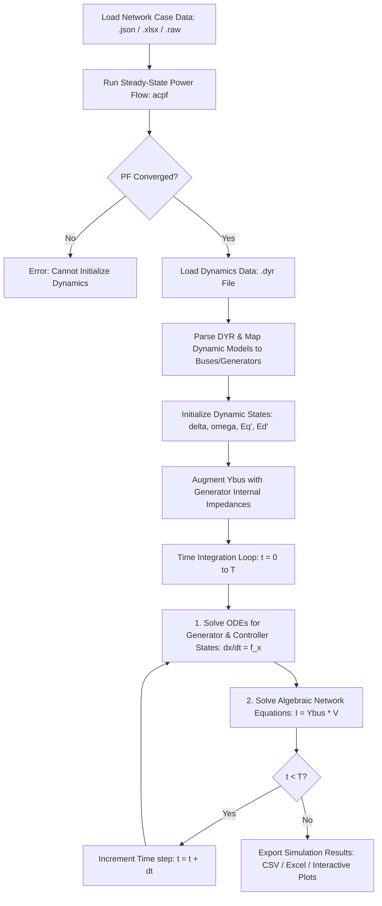
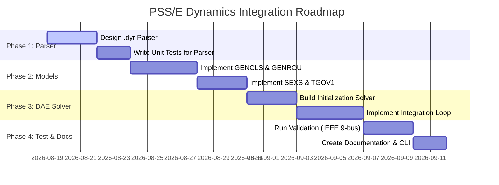

# PSS/E-Compatible Dynamic Simulation Integration Plan (`plan_pss`)

This document outlines the technical feasibility, architectural design, licensing compliance, and step-by-step implementation roadmap for integrating PSS/E-compatible dynamic simulation capabilities into `matpower-python` or releasing it as a standalone Python module.

---

## 1. Executive Summary
The core concept is based on the industry standard for power system transient stability studies: combining **steady-state power flow data** (typically in PSS/E `.raw` or MATPOWER case format) with **dynamic model parameters** (standardized in PSS/E `.dyr` format) to simulate the time-domain behavior of power systems under disturbances (e.g., short circuits, generator trips).

This plan evaluates how to parse these standard library dynamic models and run numerical dynamic simulations using Python, while remaining fully compliant with copyright, patent, and licensing laws.



---

## 2. Technical Feasibility Analysis

Transient stability simulation is a **Differential-Algebraic Equation (DAE)** initial value problem:
$$
\dot{x} = f(x, y) \quad \text{(Differential Equations: Generators, Governors, Exciters)}
$$
$$
0 = g(x, y) \quad \text{(Algebraic Equations: Network Power Balance / Admittance Matrix)}
$$

Implementing this in Python is highly feasible using modern scientific libraries:
1. **Initial State Solver**: Already fully implemented in `matpower-python` via `newtonpf` (`acpf`). The solved voltages ($V_i \angle \theta_i$) and power outputs ($P_g, Q_g$) provide the exact boundary conditions to solve for the initial rotor angles ($\delta_0$) and internal voltages ($E'_0$).
2. **File Parser**: The `.dyr` format is a space-separated or comma-separated plain text format. Writing a custom parser using Python's regular expressions or standard split functions is straightforward.
3. **DAE Integration**: Python's `scipy.integrate.solve_ivp` can be used, but for transient stability, a custom **Modified Euler** or **Implicit Trapezoidal** integration engine is typically preferred. This is because the algebraic equations $0 = g(x, y)$ must be solved simultaneously with the differential steps to ensure numerical stability at larger time steps ($\Delta t \approx 0.0083$ seconds, or half-cycle).
4. **Network Solver**: Solving $I = Y_{bus} V$ involves sparse matrix division, which is highly efficient using `scipy.sparse.linalg.spsolve` (using SuperLU or UMFPACK backends).

---

## 3. Architectural Design Options

We evaluate two architectural approaches for implementing this functionality:

### Option A: Fully Integrated Sub-Module (`power_python.dynamics`)
* **Description**: Add dynamic simulation directly to the `power_python` package as a new solver module.
* **Pros**:
  * Unified user experience: a single package install (`pip install matpower-python`).
  * Direct data access: can read and write directly to `PowerCase` matrices, adding dynamic state arrays as properties of the main object.
  * Easy CLI integration: can define a command like `transient case9 dyr_file.dyr`.
* **Cons**:
  * Increases the footprint and complexity of the core package, which is currently focused on steady-state MATPOWER parity.
  * Violates the strict separation of concerns; MATPOWER (in MATLAB) has historically avoided dynamics, leaving it to external toolboxes like PST (Power System Toolbox) or PSAT.

### Option B: Separate Python Module (`power-dynamics`)
* **Description**: Create a separate, open-source Python library that depends on `matpower-python` as its steady-state core.
* **Pros**:
  * Keeps `matpower-python` lightweight, stable, and focused on MATPOWER parity.
  * Cleaner repository organization and independent versioning.
  * Prevents dependency bloat for users who only need steady-state power flow or OPF solvers.
* **Cons**:
  * Overhead of managing and releasing two separate PyPI packages.
  * Slightly higher friction for users who need to install both packages.

### Recommendation
**Option A (Optional Sub-Module)** is recommended for implementation because it aligns with making `matpower-python` a **functional superset** of MATPOWER, providing a modern, battery-included suite that MATLAB MATPOWER lacks natively. It can be organized cleanly inside a `dynamics/` folder to prevent cluttering the steady-state code.

---

## 4. Licensing and Legal Analysis

Before starting development, we must address the legal boundaries of working with PSS/E-compatible specifications:

### 1. PSS/E Trademark
* **Issue**: "PSS/E" is a registered trademark of Siemens Industry, Inc.
* **Mitigation**: We must explicitly state that our package is an **independent, open-source development** and is not endorsed by, affiliated with, or sponsored by Siemens. We should refer to the capability as "PSS/E-compatible data parsing" or "support for `.dyr` file format" rather than naming the module `psse`.

### 2. File Format Copyright (`.dyr`)
* **Issue**: Does parsing a `.dyr` file violate Siemens' copyrights?
* **Mitigation**: No. Under copyright law, file formats are functional interfaces, and writing software to read or write a specific file format for interoperability is permitted (established by legal precedents like *Sega v. Accolade* and *Oracle v. Google*). Many tools (e.g., ANDES, PowerWorld, PSCAD) natively parse `.dyr` files.

### 3. Dynamic Model Equations (Standard Library)
* **Issue**: Are the standard library models (e.g., `GENROU`, `TGOV1`, `SEXS`) proprietary to Siemens?
* **Mitigation**: No. The equations and block diagrams describing these models are published in public IEEE standards (e.g., **IEEE Std 421.5** for exciters, **IEEE Std 1110** for synchronous machines) and textbook literature. Siemens' implementations are compiled binary code (DLLs/Fortran). Writing a clean-room implementation of these mathematical block diagrams in Python from standard public formulas is completely legal.

### 4. License Alignment
* The new code will be distributed under the same **3-clause BSD License** as `matpower-python` (and original MATPOWER), making it highly permissive for both academic research and commercial applications.

---

## 5. PSS/E Standard Model Library Selection (Phase 1)

To build a working prototype, we will implement the most common models from the PSS/E Standard Model Library:

| Category | Model Name | Description | State Variables |
| :--- | :--- | :--- | :--- |
| **Generator** | `GENCLS` | Classical machine model (constant voltage behind transient reactance). | $\delta$ (rotor angle), $\Delta\omega$ (speed deviation) |
| **Generator** | `GENSAL` | Salient pole generator model (transient $d$-axis and subtransient $d$- and $q$-axis). | $\delta, \Delta\omega, e_q', e_d'', e_q''$ |
| **Generator** | `GENROU` | Round rotor generator model (subtransient $d$- and $q$-axis). | $\delta, \Delta\omega, e_q', e_d', e_k', e_g'$ |
| **Exciter** | `SEXS` | Simplified Excitation System (lead-lag block + gain). | $x_1$ (sensor), $x_2$ (lead-lag state) |
| **Exciter** | `SCRX` | Bus-fed thyristor excitation system with negative field current limit. | $x_1$ (sensor), $x_2$ (regulator) |
| **Governor** | `TGOV1` | Simple steam turbine-governor model. | $x_1$ (governor valve), $x_2$ (turbine power) |

---

## 6. Implementation Roadmap

The implementation is structured into 4 sequential phases:



### Phase 1: Dynamic Data Parser (`dyr_parser.py`)
1. Create a parser that reads a line-by-line `.dyr` file.
2. Handle multi-line model definitions (separated by slashes `/`).
3. Parse parameters into structured dictionaries mapping generator IDs (bus number, machine ID) to model name and parameter lists.
4. Add verification check to ensure every generator referenced in `.dyr` exists in the corresponding steady-state case data.

### Phase 2: Core Dynamic Models (`models/`)
1. Create a base class `DynamicModel` defining common interfaces:
   * `initialize(Vt, theta, Pg, Qg)`: Calculates initial states from power flow operating point.
   * `derivatives(states, algebraic)`: Returns the time-derivatives of state variables ($\dot{x}$).
   * `algebraic_current(states, Vt)`: Returns the current injection vector $I_d + jI_q$ from the generator into the network.
2. Implement subclasses for `GENCLS`, `GENROU`, `SEXS`, and `TGOV1` containing the standard mathematical state equations.

### Phase 3: DAE Solver Engine (`dynamics_solver.py`)
1. **Load Flow Initialization**: Solve power flow using `runpf`. Extract terminal voltage magnitudes, angles, active, and reactive power for all generators.
2. **State Initialization**: Call `.initialize()` on all mapped generator, exciter, and governor models to determine the initial values of all state variables at $t=0$.
3. **Y-Bus Augmentation**: Modify the network admittance matrix $Y_{bus}$ by adding the internal transient (or subtransient) admittance of each generator ($1 / (R_a + jx_d')$) as a shunt admittance at the generator terminal bus.
4. **Integration Loop**:
   * Implement the **Modified Euler** predictor-corrector method:
     * **Predictor**: Estimate states at $t + \Delta t$: $x_{pred} = x_t + \Delta t \cdot f(x_t, y_t)$.
     * **Algebraic Solve**: Solve $I(x_{pred}) = Y_{bus\_aug} V_{pred}$ to find network voltages.
     * **Corrector**: Calculate corrected derivatives $f(x_{pred}, y_{pred})$.
     * **Update**: $x_{t+\Delta t} = x_t + \frac{\Delta t}{2} (f(x_t, y_t) + f(x_{pred}, y_{pred}))$.
     * **Solve Algebraic**: Resolve network equations for final voltages $V_{t+\Delta t}$.
5. **Event Handling**: Support simple events like applying a 3-phase short circuit at a bus (setting its shunt admittance to infinity or very large value) and clearing the fault (removing the shunt or tripping a branch) at specified times.

### Phase 4: Verification and CLI
1. **Validation Case**: Set up the WSCC 9-bus system (Case 9) with 3 classical generators (`GENCLS`). Apply a fault on Bus 7 at $t=1.0$s and clear it at $t=1.083$s.
2. **Plotting**: Export rotor angles ($\delta$) and terminal voltages ($V_t$) over time. Compare plots against standard reference outputs (e.g., from PSS/E or MATPOWER's MOST/PST) to ensure accuracy.
3. **CLI command**: Define a new CLI script in `pyproject.toml` called `dynamics` that executes:
   ```bash
   dynamics case9 dynamics_case9.dyr --fault-bus 7 --fault-time 1.0 --clear-time 1.083 --duration 5.0 --output csv
   ```
